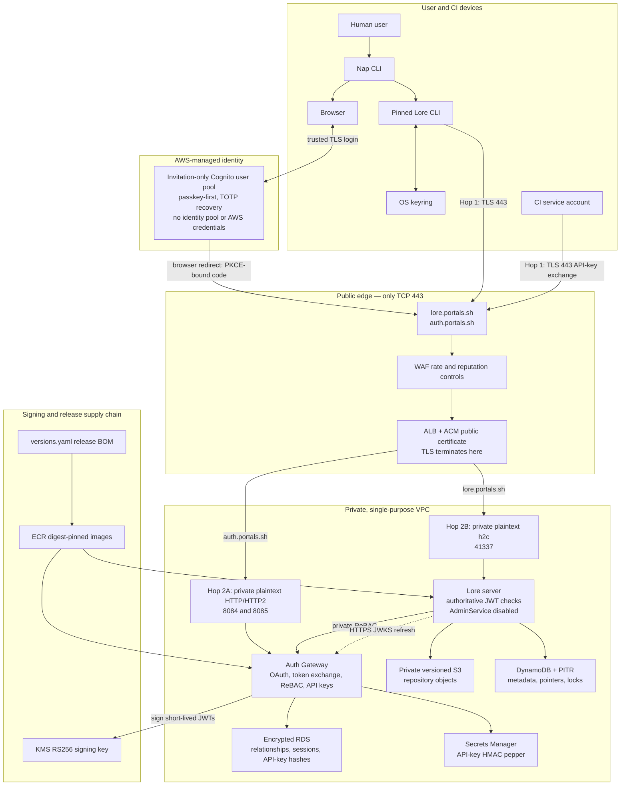

# Lore production security guide

This is the canonical deployment and incident-response guide. The accepted
architecture is [ADR 0006](../architecture-decision-records/0006-lore-production-security-boundary.md).
The concise operator sequence is in
[production release procedure](production-release-procedure.md).

## Rollout status and fail-closed gates

This repository intentionally defaults to containment: Lore and the retired
control plane are at zero, the private Auth Gateway may run for readiness and
bootstrap work, public ingress is off, and all release assertions are false.
The repository now contains the private Auth Gateway
runtime, Cognito authorization-code/PKCE flow, KMS RS256 signer and live JWKS,
persistent ReBAC/API-key implementation, recovery controls, and compatible Nap
login flow. It does **not** authorize reopening by itself.

Before a release assertion changes, grant the documented security-bootstrap
permissions, deploy the runtime and security controls, publish signed
digest-pinned images, rotate and verify live credentials, and pass the
staging/production gates below. A missing component is a release blocker;
never bypass it by setting an assertion manually.

The current AWS caller is the temporary `portals-pulumi-deployer` IAM user.
Its scoped rollout policies are intentionally temporary; they do not make a
long-lived access key production-safe. Use it only for this contained cutover,
then migrate deployment to short-lived role sessions, remove static access
keys, and retire the user before the identity revision is complete.

## Non-negotiable invariants

- Public DNS exposes only `lore.portals.sh` and `auth.portals.sh` on TLS `443`.
- `8083`, `41337`, and `41339` are closed externally; there is no NLB.
- ECS tasks use private subnets, no public IPs, scoped task roles, and no static
  AWS credentials.
- `publicIngressEnabled` stays false until `authGatewayReady`,
  `securityControlsEnabled`, and `releaseGateApproved` are all true.
- Lore production startup fails closed without complete JWT verification and
  disabled AdminService.
- Images are ECR digest references. Mutable tags are build inputs only, never
  deployment pins.
- `infra/lore/versions.yaml` identifies one compatible Lore, control-plane,
  Lore CLI, and Nap release. Public ingress rejects a contained/incomplete
  manifest even when individual images are otherwise healthy.
- A `200` liveness response is not a release gate. Readiness must prove S3,
  DynamoDB, locks, and the authenticated Nap workflow.

## Endpoint inventory

| Endpoint | Exposure | Caller | Purpose |
|---|---|---|---|
| `lore.portals.sh:443` | Public through ALB/WAF | Nap/Lore clients | TLS gRPC and authenticated repository operations |
| `auth.portals.sh:443` | Public through ALB/WAF | Nap/browser | gRPC auth exchange, OAuth callback, and JWKS publication |
| Lore `41337` | Private task network | ALB only | Plaintext h2c gRPC residual-risk hop |
| Lore `41339` | Task-local | ECS readiness only | Store-aware container readiness |
| Legacy control plane `8083` | Absent; desired count locked to zero | None | Retired unfinished issuer/API; local migration work only |
| Auth Gateway `8084`/`8085` | Private task network | ALB only | Plaintext gRPC/HTTP residual-risk hops |
| Auth Gateway `8086` | Private | Control plane only | Idempotent ReBAC/API-key mutations |
| Auth Gateway `8087` | Private | Lore SG only | Repository create/delete ReBAC coordination |
| PostgreSQL/S3/DynamoDB | Private AWS APIs | Scoped task roles | State and data stores |

## Architecture and the meaning of a network hop

A **hop** is one leg of a request between two components. A Nap operation does
not travel directly from the laptop to Lore in one connection: the first hop
is Nap to the ALB, and the next hop is the ALB to a private ECS task. TLS on one
hop does not automatically encrypt the next one.

The external hop is protected by the ACM certificate. A certificate failure is
fail-closed: the browser, Nap, or Lore CLI refuses the connection before it
sends a token or repository payload. The two ALB-to-task hops are currently
unencrypted. Security groups make them private and restrict the permitted
source to the ALB, but security groups do not provide cryptographic secrecy.

This does **not** mean that an arbitrary internet caller, another AWS customer,
or an ordinary workload can promiscuously sniff the packets. AWS authenticates
ALB-to-target VPC traffic at the packet layer, and ENI isolation prevents the
shared-LAN sniffing model familiar from unmanaged networks. The residual case
requires a compromised endpoint or routing/inspection component, deliberate
traffic observation with privileged AWS control-plane access, or a future
network design that introduces an untrusted path. See AWS's
[ALB target-group security description](https://docs.aws.amazon.com/elasticloadbalancing/latest/application/load-balancer-target-groups.html).

If a principal acquires one of those path-observation capabilities, the
unencrypted application payload can include:

- Hop 2A: eight-hour authentication tokens, service-account API keys, issued
  repository tokens, and OAuth callback data. The authorization code is
  PKCE-bound, which limits the value of the code alone.
- Hop 2B: five-minute repository tokens, repository content, metadata, and
  requested operations.

The staged resolution is:

1. Near term: keep the VPC single-purpose and unpeered, tasks private, public
   IP assignment disabled, task ingress sourced only from the ALB security
   group, token lifetimes bounded, Flow Logs active, and the risk explicitly
   reviewed every 90 days. This is the accepted initial-production boundary.
2. Re-encryption: add TLS listeners to both Lore and the Auth Gateway and change
   all three ALB target groups to `HTTPS`. Each task can generate a short-lived
   self-signed keypair at startup, so this step needs neither AWS Private CA nor
   a reusable key in an image or secret. ALB accepts self-signed target
   certificates but does not validate their identity. This prevents passive
   payload inspection at essentially no service cost; it is encryption, not
   workload authentication.
3. Full resolution: introduce authenticated workload certificates and mTLS
   through a maintained proxy/service-mesh design. Complete this before VPC
   peering, shared workloads, regulated data, or cross-provider connectivity.

Do not place a reusable private key in an image merely to turn the target group
protocol to HTTPS. Certificates require automated issuance, protected delivery,
rotation, expiry alarms, and a tested rollback. AWS Private CA has a recurring
cost; a self-managed CA avoids that fee but transfers rotation and availability
risk to the platform team.

Cognito is a user pool only. It can authenticate a user but cannot issue AWS
credentials or connect to application services.

Passkeys bind to the domain that renders Cognito managed login. While the AWS
prefix domain is used, `WebAuthnConfiguration.relyingPartyId` must be that full
`<prefix>.auth.<region>.amazoncognito.com` hostname. `auth.portals.sh` is the
gateway callback/JWKS endpoint, not the managed-login origin. A future custom
Cognito domain should use a separate hostname such as `login.portals.sh`; move
the RP ID only with that domain and verify registration/sign-in before release.

## Token contract

Authentication tokens live for at most eight hours. Authorization tokens live
for at most five minutes and contain:

- exact HTTPS `iss`;
- audiences containing `lore` and recipient-protection root `portals.sh`;
- `env` equal to the Lore deployment environment;
- `iat` and `exp`;
- an RS256 header with a known, nonempty `kid`;
- one and only one `resource_id` in the form `urc-<repository-id>`;
- only the permissions derived server-side from relationships.

Audience-domain matching uses DNS label boundaries: `portals.sh` and
`api.portals.sh` match; `evilportals.sh`, wildcards, empty roots, and suffix
lookalikes do not. Normal operations require read/write. Sharing and deletion
require `owner` and are not represented by wildcard data-plane permissions.

## Relationships and reconciliation

`resource_relationships` accepts only repository resources, concrete subject
and resource IDs, and `owner`/`collaborator`. Both relations permit ordinary
repository use. Only owners may mutate sharing or request deletion.

Lore creates durable repository metadata first, then asks the private ReBAC
service to upsert the owner and a completed reconciliation row in one database
transaction. A retry that finds the repository already present still repeats
that idempotent ReBAC write, repairing the precise partial-failure case where
storage succeeded but authorization persistence did not.

Deletion is two phase: ReBAC first records and authorizes an owner request;
after Lore removes the repository, Lore confirms deletion and the gateway
atomically removes relationships. Lost responses are safe to retry, including
the case where Lore is already gone. Never infer repository existence from a
caller-supplied flag or delete an unconfirmed orphan automatically.

Sharing mutations require both the private internal-service bearer and the
initiating user's authentication token. The gateway re-derives the actor and
checks the current owner relationship. A database constraint permits only one
role per subject/repository, and the final owner cannot be removed or
downgraded.

## Service-account API keys

The presentation format contains a public UUID plus a 32-byte random secret.
Only HMAC-SHA256 over `(key_id, secret)` is stored. The HMAC pepper is versioned
in Secrets Manager. Verification uses the HMAC library's constant-time compare.
Keys are repository-scoped through relationships, revocable, rate limited,
valid for at most 90 days, and may overlap a replacement for at most 24 hours.
Return the plaintext once and never log it. CI exchanges it for a five-minute
authorization token; the API key is never sent to Lore.

Pulumi creates a 32-byte pepper in Secrets Manager. The Auth Gateway task role
receives `GetSecretValue` only for that ARN; the ECS execution role receives
only the database/internal-token secrets it must inject. Changing
`credentialRotationEpoch` creates a new pepper and database password version
and therefore requires an approved, coordinated rotation.

Disabling a service account revokes all its keys and blocks further repository
token exchanges immediately. Already-issued repository tokens remain usable
for no more than five minutes. A single-key revocation does not disable the
service account or its other keys.

## Signing-key rotation

1. Create a new asymmetric KMS RSA key and `kid`.
2. Deploy the gateway privately with `jwtSigningEnabled=false` and verify its
   store-aware health check.
3. For the initial key, set `jwksPublicationEnabled=true` to expose only HTTPS
   JWKS and health. The callback, Auth gRPC, and Lore routes remain absent, and
   Pulumi currently refuses this bootstrap mode if signing is enabled. This is
   not sufficient for the intended private Lore signed-token test. Before a
   production release, change the edge to retain JWKS/health-only TLS routing
   while signing is enabled, without enabling Lore, callback, or Auth gRPC
   routes. During later rotations, publish the new JWK alongside the
   still-active old key.
4. Verify the live JWKS contains the expected `kid`; wait at least 60 seconds
   and verify every running Lore task fetched the new set.
5. Activate RS256 signing only after the JWKS-only signed-edge correction has
   passed private Lore tests. Enable the complete edge only after the release
   gates pass.
6. Retain the old public JWK for eight hours plus ten minutes.
7. Disable the old signer, monitor unknown-`kid` failures, then retire the key.

Emergency revocation removes the JWK, restarts Lore to clear the cache, revokes
sessions/API keys, and keeps ingress closed until fresh credentials pass E2E.
The ten-minute stale window is an availability concession, not a revocation
guarantee; restart is required for immediate invalidation.

Set retired KMS key ARNs in `jwtRetiredKmsKeyArns` before activating the new
key. The gateway publishes active and retained public keys; only the active key
can sign. Remove retired ARNs only after the retention window.

## Local credential handling

Cloud mode requires OS keyring encryption. Keyring failure is fatal; Lore does
not silently write a token file. The explicit isolated-development fallback
uses owner-only permissions (`0600`) and emits a warning. Never enable that
fallback on shared runners, remote workstations, or production hosts.

## Data protection and recoverability

- RDS: encryption, deletion protection, final snapshot, forced TLS, and a
  restoration rehearsal. Paid production stacks should use 35-day automated
  PITR. While the account caps automated retention at one day, enable
  `lowCostRdsSnapshotsEnabled=true`; the stack runs one 128 MB ARM Lambda daily,
  retains seven encrypted native manual snapshots, prunes only snapshots with
  the stack-owned prefix, and alarms on Lambda failures. It requires no NAT,
  database credential, or continuously running backup task.
- S3: public access blocked, TLS-only policy, encryption, versioning, and no
  `forceDestroy`.
- DynamoDB: encryption and point-in-time recovery for fragments, metadata,
  mutable pointers, and locks.
- Test restoration quarterly into an isolated account/VPC, validate hashes and
  branch pointers, acquire/release a lock, then destroy only the test restore.

`Obliterate` is not a production recovery tool. It permanently removes
content-addressed data and can invalidate every reference to that address.
Production returns `UNIMPLEMENTED`. Any future destructive workflow needs a
ticket, two-person approval, exact repository/address allowlist, dry run,
backup confirmation, immutable audit record, rate limit, and post-restore test.

The manual-snapshot bridge provides daily recovery points, not seven days of
point-in-time recovery. RDS automated and manual snapshots share the account's
backup-storage allowance; inspect billed backup storage after each restoration
test. If snapshot storage approaches the allowance, shorten manual retention or
move to paid PITR deliberately—never silently stop backups. A periodic
`pg_dump -Fc` is useful as a format-independent second copy but is slower to
restore and does not replace native snapshots/PITR.

## Logging, detection, and alarms

The mandatory baseline before release is CloudTrail with validation, an
account-level IAM Access Analyzer for external access, ALB/WAF logs, VPC flow
logs, ECR and Trivy image gates, ECS application logs, database alarms, target
health alarms, 4xx/5xx and WAF-block alarms, unknown-`kid`/auth-failure alarms,
store-readiness alarms, and backup-age alarms. Logs must redact tokens, API-key
secrets, cookies, authorization headers, database URLs, and signing material.
WAF common HTTP inspection is scoped to the small callback/JWKS/health routes;
it does not parse binary gRPC bodies. WAF logs redact `Authorization`.

GuardDuty and Security Hub remain recommended paid enhancements, not assertions
that may be faked to pass a free-plan deployment. When they are unavailable,
the baseline above is the compensating detection profile. Public ingress also
requires a real `securityReviewDate` no more than 90 days old. Each review must
triage Access Analyzer findings, CloudTrail anomalies, alarm history, image and
dependency scan results, backup age, restore evidence, IAM last-used data, and
all residual-risk assumptions. Record the reviewer, date, findings, and closure
links; changing the date without performing the review is a gate bypass.

The baseline is cost-minimized, not guaranteed to produce a zero-dollar bill:

| Control | Cost posture |
|---|---|
| IAM Access Analyzer | External-access analyzer only; no additional charge. Do not enable paid internal/unused analyzers implicitly. |
| CloudTrail | One copy of management events is free from CloudTrail; the S3 objects and requests still cost money. Data events are not enabled by this baseline. |
| ALB access logs | No ELB delivery charge; compressed S3 storage/requests still cost money. |
| ECR + Trivy | ECR basic scanning has no additional scan charge; Trivy runs in the existing build runner. ECR image storage still costs money. |
| Lambda snapshot scheduler | One invocation per day is far below the Lambda and EventBridge Scheduler free allowances, but RDS snapshot bytes above the account's backup allowance are billed. |
| CloudWatch alarms | Standard service metrics are free; only the first ten standard alarm metrics per account are in the ongoing free allowance. Keep the targeted set, but budget for any excess. |
| WAF | Required when the public edge opens, but not free: web ACL, rules, and inspected requests are billed. |

## Containment

1. Set all service desired counts to zero and `publicIngressEnabled=false`.
2. Revoke public SG ingress immediately.
3. Preview/apply deletion of the NLB, direct listeners, and ports.
4. Preserve logs and snapshot state.
5. Inventory and invalidate all tokens and possibly exposed secrets.

## Deployment and rollback

Deploy private stores/roles first, then identity/JWKS, gateway/ReBAC, Lore, and
Nap staging tests. Publish JWKS before activating a signer. Promote one ECR
digest from staging to production; do not rebuild between environments.

Image publication and image promotion are separate operations. Publication may
leave an untrusted digest in ECR. Promotion must resolve the configured Fargate
platform child manifest, require zero critical/high findings from ECR and
Trivy, decode the attached SBOM and provenance, and bind those results to the
exact index and platform digests in `infra/lore/verified-images.json`. Pulumi
rejects a running pin without that receipt. Public ingress additionally
requires a verified cosign signature. Unfixed critical/high findings are not
silently ignored; they require remediation or an explicit reviewed exception.

`infra/lore/versions.yaml` is the release bill of materials, not a list of
"latest" versions. `lore.image` is the Lore server image. The active
`control-plane.image` is the private Auth Gateway image; the old
caller-selected-claims issuer is recorded separately as retired and has no
image pin. `lore-client` separately records the `portalshq/lore` fork commit,
the pinned Epic upstream commit, release tag, installer checksum, and signed
artifact manifest. Nap is not a container: `nap-client` records its exact Git
commit, tag, signed `SHA256SUMS` digest, Sigstore bundle, and references the
exact top-level Lore client version it installs. All components must declare
the same security contract. `release.status` stays `contained` or `candidate` until authenticated
E2E and the remaining checklist pass; only a reviewed release may set it to
`approved`.

The Nap release job also refuses to publish until that Lore client release has
a pinned binary `SHA256SUMS` digest and Sigstore bundle. Pinning only the Lore
installer script is not sufficient because an altered release tarball could
still report the expected version. Pulumi also requires the exact Nap/Lore
metadata and resolved Lore release-tag source commit to match
`verified-releases.json`, which is written only after both Sigstore identities
and all downloaded checksums are verified.

Production publishers refuse dirty source trees. They label images with the
full source/protocol/packaging commits, require those labels in BuildKit
provenance, and record the same commits in the verification receipt and release
manifest. An immutable digest built from uncommitted work is useful for private
testing but is not a reproducible production release.

Rollback keeps ingress closed, sets services to zero, restores the last known
digest/config, restores state if a migration is incompatible, and reruns all
negative and data-plane gates before reopening. Do not restore an exposed key.

## Release checklist

The `Security Gates` workflow runs Auth Gateway unit tests, a disposable real
PostgreSQL migration/ReBAC/API-key lifecycle test, Lore compilation, Pulumi
policy assertions, npm and RustSec dependency audits, and a filename-only
credential scan. A separate CodeQL workflow runs security-extended Rust and
TypeScript analysis. Image publishers attach BuildKit provenance and SBOM
attestations; ECR scan findings and cryptographic signature verification must
be clear before a digest is promoted.

- [ ] Previously exposed signing, S3, database, TLS, and runtime credentials rotated.
- [ ] Only digest-pinned ECR images are configured; SBOM and signature verified.
- [ ] Image receipts match clean committed source/protocol/packaging revisions.
- [ ] The signed Nap release and its pinned `portalshq/lore` client match the
      release security contract in `versions.yaml`.
- [ ] Lore refuses missing/wrong issuer, audience, environment, algorithm,
      expiration, `kid`, repository, permission, wildcard, and revoked tokens.
- [ ] AdminService returns `UNIMPLEMENTED`.
- [ ] Public probes show only TCP 443; `8083`, `41337`, and `41339` are closed.
- [ ] Control-plane and ReBAC mutation endpoints are unreachable publicly.
- [ ] Store-aware readiness is healthy on every task.
- [ ] Nap staging passes login, create, clone, push, pull, sync, publish, lock,
      logout, expiry, and CI API-key exchange.
- [ ] Actual fragment S3/Dynamo serialization and lock round trips pass.
- [ ] Dependency, SAST, secret/dataflow, IaC, container, SBOM, and signature
      scans have no unresolved critical/high findings.
- [ ] Restore rehearsal and incident contacts are recorded.
- [ ] Daily manual RDS snapshots are healthy when automated PITR is under seven days.
- [ ] Access Analyzer findings are triaged and `securityReviewDate` records a review within 90 days.
- [ ] `authGatewayReady`, `securityControlsEnabled`, and only then
      `releaseGateApproved` are set; enable `publicIngressEnabled` last.

## Migration invalidation notice

This rollout invalidates every previously issued bearer token and every
credential that could have been exposed by the former public topology. Users
and CI must authenticate again; CI must exchange a newly created service-account
API key. No legacy token is grandfathered.
