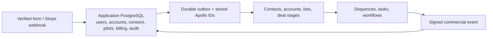

# portals lead operations

The website stores every verified form submission, application user, customer account, consent record, pilot, billing record, and audit event in PostgreSQL. Apollo is a one-way sales projection: every verified lead becomes a contact; an Apollo account is created only after the application creates a real customer account for a pilot; the pilot deal then links both. Apollo is never the application system of record.

## Cutover order

1. Export Attio, preserve it read-only for legacy history, and run `npm --workspace frontend run migrate:leads`.
2. In a disposable Apollo workspace, run `npm --workspace frontend run provision:apollo`. It creates and verifies every configured list and custom field from `config/apollo-lead-operations.json`.
3. Create the three deal stages in Apollo Settings: `Pilot Requested`, `Paid Pilot`, and `Customer`, then rerun `provision:apollo` to verify them. Apollo’s public API documents stage listing, but not stage creation.
4. Set `APOLLO_API_KEY`, `APOLLO_CALLBACK_SECRET`, Resend, Stripe, and database secrets. The application discovers custom-field and deal-stage IDs directly from Apollo by their declarative labels, so no field, option, or stage mapping variables are required. Run a real test submission and a Stripe test payment before switching production traffic from Attio to Apollo.

Apollo lists are preserved exactly by display name: Inbound Leads, Guide Downloads, Production Assessments, Pilot Requests, Qualified Opportunities, Paid Pilots, Customers, and Nurture. Contacts retain their historical lists. Each Apollo account belongs to at most one operational list.

## Ownership and synchronization

- A pilot applicant receives an application user, customer account, owner membership, and pilot membership. That application customer account maps one-to-one to the Apollo account. Invited colleagues receive their own magic-link account and a scoped membership.
- A configured `LEADS_NOTIFICATION_EMAIL` is granted staff/admin access and approver access for each pilot; it does not become the customer account owner.
- Apollo record IDs are persisted in `crm_external_records`; retries do not depend on Apollo search or deduplication. The `crm_outbox` retries sales-stage changes with backoff.
- Apollo workflows may enroll a contact into a sequence only when the application’s marketing consent is true. Native Apollo unsubscribe prevents future enrollment; application consent remains authoritative.
- Apollo is the place for founder-maintained sales notes and commercial deal stages. The application retains submission history, raw encrypted responses, payment, customer data, and audit history because the public API cannot create or update Apollo notes.

## Lifecycle and workflows

The application advances automated lifecycle values only through `Pilot Requested`. Founder-controlled Apollo values — Pilot Scoped, Paid Pilot, Annual Proposal, Customer, Nurture, and Disqualified — must not be overwritten by later form activity. Payment projects `Paid Pilot`; activated customers may project `Customer` through the durable CRM outbox.

Use Apollo workflows for sequence enrollment, tasks, owner assignment, and outbound webhooks. Configure a workflow webhook to `POST /api/leads` as a `commercial_event` and set `x-portals-signature` to the base64url HMAC-SHA256 of the exact request body using `APOLLO_CALLBACK_SECRET`. Send an idempotency key, known work email, and structured commercial event only — no free text or payment authority.

## Operations and privacy

`LEADS_DRY_RUN=true` is the supported local no-integration mode. It simulates submissions, accounts, pilots, and payments in memory and never contacts Apollo, Stripe, Resend, or PostgreSQL.

Vercel invokes `/api/internal/leads/retry` every ten minutes. Lead and CRM outboxes are leased and retried; inspect their `last_error`, correct the configuration, and move the affected row to `retry` to replay it. Raw encrypted submissions are redacted after 30 days once the intake outbox completes. The opaque profile cookie expires after 90 days.

Mixpanel starts only after analytics consent. Do not send identity, messages, application answers, or workflow descriptions to browser analytics.
