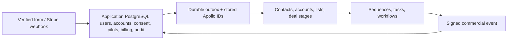

# Lead qualification and CRM integration

## System architecture

The application database is the system of record: lead profiles, application users, customer accounts, pilot rooms, memberships, payment, consent, raw submissions, and audit history live here. Apollo is a one-way sales projection, never the source for application state.



A verified lead submission is persisted first, then processed through `lead_outbox`. A successful form response does not prove external work completed; outbox actions retry independently.

Apollo sync is Contact-first. Every verified browser lead submission creates or updates the Apollo Contact before any Account or Deal work. The Contact receives standard identity fields, native Contact stage when available, lists, consent, attribution, latest submission metadata, qualification state/tier, fit/pain/intent scores, next action, and current form answers.

Apollo Accounts are created or updated after the Contact for every verified lead with a company name and a non-public company domain or website. The app deduplicates the prospect Account by that normalized domain and links the Contact immediately. When a pilot approval room creates a real `customer_account`, its local mapping is attached to the same Apollo account; generic-email leads without a company website do not create an Account. The Account receives company-level scores, qualification state/tier, next action, canonical first/last-touch URLs, native Account stage when available, and operational account lists.

Apollo Deals are created or updated only after Contact and Account sync succeed. The app links the Deal to both records and advances Deal stages from app-owned events: `Pilot Requested`, `Paid Pilot`, and `Customer`.

- A pilot applicant receives an application user, customer account, owner membership, and pilot membership. That application customer account maps one-to-one to the Apollo account. Invited colleagues receive their own magic-link account and a scoped membership.
- A configured `LEADS_NOTIFICATION_EMAIL` is granted staff/admin access and approver access for each pilot; it does not become the customer account owner.
- Apollo record IDs are persisted in `crm_external_records`; retries do not depend on Apollo search or deduplication. The `crm_outbox` retries sales-stage changes with backoff.
- Apollo workflows may enroll a contact into a sequence only when the application's marketing consent is true. Native Apollo unsubscribe prevents future enrollment; application consent remains authoritative.
- Apollo is the place for founder-maintained sales notes and commercial deal stages. The application retains submission history, raw encrypted responses, payment, customer data, and audit history because the public API cannot create or update Apollo notes.

## CRM integration technical details

Apollo custom fields, lists, and native stage name assumptions are declared in `frontend/config/apollo-lead-operations.json`; provision/runtime discovery use labels. Apollo's Fields endpoint returns namespaced IDs, so the sync removes the `contact.` / `account.` / `opportunity.` prefix before placing an ID in `typed_custom_fields`. The config is the definitive list of custom-field values produced by the app.

Apollo is updated from durable verified submissions and app events through `lead_outbox` / `crm_outbox`, not directly from analytics page-view events. Analytics can inform future scoring only after becoming app-owned submission or event data.

Preserve `crm_external_records` as the local Apollo-ID ledger and `crm_outbox` for retries. Do not query Apollo as reconciliation/source-of-truth and do not dual-write to Attio.

Do not enable Apollo `run_dedupe` when creating contacts. It can match on non-email data and overwrite a different person. Application email identity plus the local ID ledger provide the safe deduplication boundary.

Mixpanel analytics is consent-gated and separate from CRM. Client identifiers/attribution support analytics only; do not use them as CRM identity.

### Progressive qualification fields

All website forms collect two qualification questions:
- `whatBroughtYouHere`: Enum value indicating primary motivation (workflow-problem, assess-scaling, evaluating-tools, other)
- `whatBroughtYouHereOther`: Free-text detail when "other" is selected
- `howDidYouHearAboutPortals`: Enum value indicating discovery channel (google-search, linkedin, email, someone-company, friend-colleague, article-newsletter-podcast, partner-company, social-media)

These fields are stored at the lead submission level (both in encrypted payload and in dedicated database columns) and projected to Apollo Contact custom fields for sales context.

### Apollo deal role mapping

Pilot submissions map team-member fields to Apollo deal contact roles:
- Identity name/email → `Initial Contact`
- Production owner name/email → `Project Manager`
- Economic buyer name/email → `Buyer`
- Technical evaluator name/email → `Evaluator`
- Approver name/email → `Decision Maker`
- Signer name/email → `Contract Signer`

Role entries are only emitted when both name and email are present. The mapped roles are serialized into the Apollo opportunity custom field `Deal contact roles` as a JSON array until native Apollo contact-role API endpoints are identified and integrated.

### Production owner email

The pilot controlled fields include `productionOwnerEmail` as a required field. This email is persisted in the `lead_pilots` table, used for reviewer invitations, and projected to the Apollo Contact custom field `Production owner email`.

## Progressive qualification

The workflow assessment is the single prospect-facing qualification flow. It asks about a real creative-production workflow, the pain it creates, the desired outcome, and only the practical context needed to recommend a next step. Do not reintroduce a separate "pilot readiness" form after the assessment result.

`assessment` submissions are merged with the lead profile's previous qualification answers in `frontend/app/api/leads/route.ts`. `frontend/src/lib/leads/scoring.ts` scores fit, production-memory pain, and intent from that merged record. A credible workflow with sufficient fit and pain can move directly to `pilot_scope` when the assessment also establishes timing, ownership, approval path, and the prospect's stated question or friction. Otherwise, return the most relevant workflow/use-case recommendation. The legacy `commercial_readiness` submission type remains parseable only to preserve earlier submissions; do not use it for new UI.

Keep the form value-led: describe the concrete output first—less rediscovery, fewer recreated assets, faster repeatable production, and lower cost. Questions about approval or a pilot must make clear that they do not commit the prospect to either.

## Adding or changing form fields

Form fields belong to one or more of these categories:

- `general`: identity, attribution, discovery, and context that can apply across lead flows.
- `assessment`: inputs that measure workflow fit, repeatability, or production-memory risk.
- `pilot`: context used to decide whether a customized pilot plan is practical.
- `system`: internal lifecycle, consent, score, and synchronization metadata; never expose these as ordinary prospect questions.

For any field that is captured from a prospect, update every applicable layer:

1. Add or adjust the UI in `frontend/src/components/leads` with a clear, outcome-oriented label and useful placeholder.
2. Validate it in `frontend/src/lib/leads/contracts.ts`; include it in the appropriate submission schema.
3. If it changes qualification, add a scored signal or readiness rule in `frontend/src/lib/leads/scoring.ts`, and merge/route it in `frontend/app/api/leads/route.ts`.
4. Define its Apollo custom-field entry in `frontend/config/apollo-lead-operations.json` with `key`, `label`, Apollo `type`, `modalities`, and `categories`. Keep the field label stable after it is provisioned; changing it creates a separate Apollo field.
5. Map the answer in `contactFields` in `frontend/src/lib/leads/crm.ts`. The CRM is a projection of Portals data, never the source of truth.
6. Update tests for validation, score/routing, and CRM mapping when the new field affects them.

`tools_used` is the reference field: it is a single text input for a comma-separated list of relevant tools, is stored in Apollo as the `Tools used` contact custom field, and is categorized as both `general` and `pilot`. The scoring layer accepts both this text list and historical count-shaped values so old submissions remain valid.

## Apollo provisioning

`frontend/scripts/provision-apollo.ts` provisions and verifies the lists and custom fields described by `frontend/config/apollo-lead-operations.json`. Apollo's public endpoint only accepts scalar field types, so category metadata is maintained in the config for Portals' form architecture and documented flow; it is not sent as a remote Apollo field group.

When a change adds, renames, changes the modality/type of, or otherwise requires an Apollo custom field, agents must automatically run provisioning as part of the implementation—do not leave this as a manual follow-up:

```sh
npm --workspace frontend run provision:apollo
```

Run it only after the config and provisioner changes are complete, with `APOLLO_API_KEY` available through `frontend/.env.local`. The script is idempotent and verifies the final remote schema. If credentials or network authorization are genuinely unavailable, report that precise blocker in the handoff; never claim the field was provisioned.

## Lifecycle and workflows

The application advances automated lifecycle values only through `Pilot Requested`. Founder-controlled Apollo values — Pilot Scoped, Paid Pilot, Annual Proposal, Customer, Nurture, and Disqualified — must not be overwritten by later form activity. Payment projects `Paid Pilot`; activated customers may project `Customer` through the durable CRM outbox.

## Outbound evidence and lifecycle ownership

Use Apollo's native lifecycle objects as the source of truth. Do not create custom fields that duplicate them:

- Contact `Stage` owns the pre-deal lifecycle. Apollo automatically moves a contact to `Replied` when a reply is received; never recreate reply state in a custom field.
- Pilot requests automatically create deals. Pilot scoping, paid-pilot, and customer progress belong to the existing deal and account stages, not contact custom fields.
- The original reply or conversation is the source of truth for customer language. Keep useful verbatim language in the Apollo email activity or a contact Note; do not copy a subjective "best sentence" into a custom field.

Use these evidence definitions in reports:

- `contacted`: a unique contact received at least one successfully delivered email. Scheduled contacts do not count.
- `responded`: a unique contact sent a human reply. Exclude out-of-office and automated responses; include positive, negative, and problem-denying replies.
- `problem confirmed`: the reply explicitly says that the described production failure exists for the prospect's team. Interest in Portals without confirmation does not count.
- `active relevant workflow`: the prospect identifies a current, imminent, or recurring production that could be evaluated. A hypothetical use case does not count.
- `pilot scoping`: the automatically created deal has entered pilot scoping through a completed scope request, a scoping conversation, or supplied scope inputs. A generic request for information does not count.
- `paid pilot`: payment or an executed commercial commitment is recorded on the deal. Verbal interest does not count.
- `repeatability evidence`: report the eligible cohort, delivered denominator, time window, sequence and wave, first-touch versus recycled status, and the full ladder from replies through paid pilots.

Opens and clicks are delivery diagnostics, not evidence that the problem is urgent. Preserve exact prospect language when it changes the problem definition, consequence, or buying condition.

## Reply follow-up automation

The Apollo workflow for outbound replies must trigger when Contact Stage becomes `Replied`. It creates one high-priority `Review reply and respond` task due the next business day, links the contact and account, and notifies the assignee. Assign through an active-team-member round robin; discover the eligible users at runtime instead of hard-coding Andreas. If only one active Apollo user exists, the same rule naturally assigns every task to that user.

The task instructions are: read the full thread, respond manually, classify whether the problem is confirmed, identify any active workflow and consequence, preserve useful verbatim language in the contact Note, and advance the native contact or deal stage only when the corresponding evidence exists. Do not create a duplicate task if an open reply-review task already exists for the contact.

Use Apollo workflows for sequence enrollment, tasks, owner assignment, and outbound webhooks. Configure a workflow webhook to `POST /api/leads` as a `commercial_event` and set `x-portals-signature` to the base64url HMAC-SHA256 of the exact request body using `APOLLO_CALLBACK_SECRET`. Send an idempotency key, known work email, and structured commercial event only — no free text or payment authority.

## Reusable outbound ICP

Build reusable Apollo account and contact searches from these qualities. Company size is not a filter: include startups through enterprises, but exclude solo creators unless they operate a production team.

Ideal accounts:

- Produce commercial AI video, animation, VFX, virtual production, or AI-heavy creative work; an enterprise qualifies when it has a dedicated AI-production function.
- Deliver recurring client, campaign, episodic, character, or variant work rather than isolated experiments.
- Use multiple generation, image, video, editing, or compositing tools, making cross-tool production history consequential.
- Present an English-language buying surface and can support an English-language sales process globally.
- Exclude software-only vendors, training businesses, staffing firms, experimental-art-only practices, and general agencies with no visible AI-production work.

Ideal contacts:

- Primary titles: Head, Director, or VP of Creative Operations, AI Production, Production Operations, Creative Production, or Production; Head of Production; and Executive Producer.
- At smaller companies, include operational founders, owners, and studio executives who control delivery or budget.
- Include Creative Directors only when public evidence shows ownership of production workflow, delivery, or budget. Do not target Creative Directors as a broad title category.
- Exclude junior individual contributors, recruiters, software roles, and creative leaders without operational ownership.
- Start with one primary contact per account. Keep every contact from the same account in the same experiment arm.

Character-continuity accounts must additionally show recurring characters, branded characters, virtual talent, episodic work, multiple shots with the same subject, or another visible need to carry a character across tools, creators, revisions, or production cycles. Route ambiguous accounts to conversational discovery.

Reserve 25% of eligible, never-contacted accounts as a stratified account-level holdout. Do not enroll, email, or approach adjacent contacts at those accounts during the experiment. Release the remaining accounts in three waves equal to 30%, 20%, and 25% of the full eligible cohort, with allocation decisions after the first and second checkpoints.

## Operations and privacy

`LEADS_DRY_RUN=true` is the supported local no-integration mode. It simulates submissions, accounts, pilots, and payments in memory and never contacts Apollo, Stripe, Resend, or PostgreSQL.

Vercel invokes `/api/internal/leads/retry` every ten minutes. Lead and CRM outboxes are leased and retried; inspect their `last_error`, correct the configuration, and move the affected row to `retry` to replay it. Raw encrypted submissions are redacted after 30 days once the intake outbox completes. The opaque profile cookie expires after 90 days.

Mixpanel starts only after analytics consent. Do not send identity, messages, application answers, or workflow descriptions to browser analytics.
